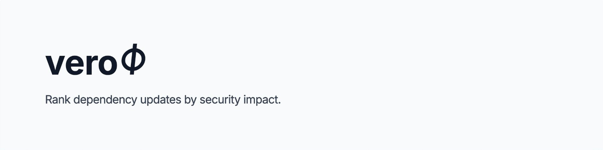

<p align="center">
  
</p>

[](https://github.com/verophi/verophi/actions/workflows/ci.yml)
[](LICENSE)
[](go.mod)

Trivy finds CVEs. Renovate creates updates. verophi ranks them by security impact.

## Requirements

verophi needs:
- A CycloneDX SBOM **with vulnerability data** (e.g. from `trivy fs --format cyclonedx --scanners vuln`)
- Open Renovate updates in the target repository
- Access to the GitHub or GitLab repository (token optional for public repos)

## Try it in 30 seconds

Uses the public test-fixtures project on GitLab (intentionally outdated dependencies, open Renovate updates). Requires Docker and curl; no Trivy install or token needed.

```bash
# Download pre-generated SBOM (no Trivy needed)
curl -fsSLO https://raw.githubusercontent.com/verophi/verophi/main/examples/demo-sbom.json

# Run against the public test-fixtures project (no token needed)
docker run --rm -t -v "$PWD/demo-sbom.json:/sbom.json:ro" ghcr.io/verophi/verophi:latest \
  analyze --sbom /sbom.json --gitlab-project verophi/test-fixtures
```

## Quick start

### GitLab CI

```yaml
# .gitlab-ci.yml — zero config, uses built-in CI_JOB_TOKEN
verophi:
  image: ghcr.io/verophi/verophi-trivy:latest
  script:
    - trivy fs --format cyclonedx --scanners vuln --output sbom.json .
    - verophi analyze --sbom sbom.json --gitlab-token $CI_JOB_TOKEN --gitlab-project $CI_PROJECT_ID
  allow_failure: true
```

### GitHub Actions

```yaml
# .github/workflows/verophi.yml
- name: verophi
  run: |
    trivy fs --format cyclonedx --scanners vuln --output sbom.json .
    verophi analyze --sbom sbom.json --github-token ${{ secrets.GITHUB_TOKEN }} --github-repo ${{ github.repository }}
```

### Locally

Install verophi (see [Install](#install)) and Trivy first.

```bash
# GitLab
trivy fs --format cyclonedx --scanners vuln --output sbom.json .
verophi analyze --sbom sbom.json --gitlab-token $TOKEN --gitlab-project 12345

# GitHub
trivy fs --format cyclonedx --scanners vuln --output sbom.json .
verophi analyze --sbom sbom.json --github-token $TOKEN --github-repo myorg/myrepo
```

## Example output

```
verophi v0.1.0  demo-sbom.json (CycloneDX 1.7)  gitlab:verophi/test-fixtures

CVEs        119     C:16 H:57 M:39 L:7
CVE match   46/119
VIS         441     reducible: 213, remaining: 228
MRs         39      matched: 21, no match: 17, unparsed: 1
severity    C critical  H high  M medium  L low

note: MR VIS can overlap; reducible VIS counts matched CVEs once.

MERGE FIRST  (by VIS, then VME)

    1  !127  Pillow 9.0.0 -> 10.2.0              major    VIS 36  VME 12.0
             fixes 6 CVEs  C:3 H:3 M:0 L:0
             https://gitlab.com/verophi/test-fixtures/-/merge_requests/127

    2  !117  org.apache.logging.log4j:log4j-c... minor    VIS 32  VME 16.0
             fixes 4 CVEs  C:4 H:0 M:0 L:0
             https://gitlab.com/verophi/test-fixtures/-/merge_requests/117

    3  !135  actionpack 6.1.4 -> 6.1.7.8         patch    VIS 30  VME 30.0
             fixes 8 CVEs  C:1 H:4 M:3 L:0
             https://gitlab.com/verophi/test-fixtures/-/merge_requests/135

    ...

CVEs WITHOUT A MATCHED MR  (73)
  SEV  ID                   DEPENDENCY        NOTE
  C    CVE-2025-62718       axios@0.21.1
  C    CVE-2026-42043       axios@0.21.1
  C    CVE-2026-4800        lodash@4.17.20
  C    GHSA-353f-x4gh-cqq8  nokogiri@1.13.10
  H    CVE-2022-24999       qs@6.7.0
  +68 more (--verbose)

MRs WITHOUT A MATCHED CVE  (17)
  MR    DESCRIPTION                                    RISK
  !101  fix(deps): pin dependencies                    pin
  !102  python-multipart 0.0.5 -> 0.0.18               patch
  !104  chalk 4.1.0 -> 4.1.2                           patch
  !105  dio 4.0.0 -> 4.0.6                             patch
  !108  esbuild 0.1 -> 0.10                            minor
  +12 more (--verbose)

MRs WITH NO CHANGES PARSED  (1)
  MR    TITLE
  !136  chore(deps): lock file maintenance
```

**Reading the ranking:** the summary `VIS` (441 here) is the total severity-weighted CVE
impact in the SBOM. Each update's `VIS` is the impact it fully addresses; higher ranks
first. `VME` is an update's VIS divided by its merge-risk tier (patch, pin, bump = 1;
minor = 2; major, rollback = 3). `reducible` is the deduplicated VIS that open updates
remove together; `remaining = total - reducible` is what no open update covers. `fixes N
CVEs` means the target version contains the scanner-reported fix, not a verified-after-merge
claim.

An update may fix only part of a CVE that affects several components. When other open
updates cover the rest, the row shows `needs !N to fully fix <CVE>` (`#N` on GitHub) and
you should merge them together.

The same analysis is available in four other output modes: `--format compact` (one dense
row per matched update), `--format verbose` / `--verbose` (per-update diagnostics: status, age,
labels, and the advisory ids each update matches), `--format json`, and `--format quiet`
(no output, exit code only). On GitHub the nouns and ids switch to `PR` / `#`.

### JSON output

`--format json` emits a stable, machine-readable result (`schemaVersion` 1.0) for CI
gates and dashboards. The full contract is described by a JSON Schema:
[`schema/analysis-result-1.0.schema.json`](schema/analysis-result-1.0.schema.json).

<details>
<summary>Example JSON (trimmed)</summary>

```bash
verophi analyze --sbom sbom.json --gitlab-project verophi/test-fixtures --format json
```

```json
{
  "schemaVersion": "1.0",
  "correlation": { "status": "complete", "platform": "gitlab", "repository": "verophi/test-fixtures" },
  "advisorySummary": { "total": 119, "correlated": 46, "uncorrelated": 73, "critical": 16, "high": 57, "medium": 39, "low": 7 },
  "totalImpactScore": 441,
  "reducibleImpactScore": 213,
  "changeRequests": [
    {
      "number": 127,
      "title": "chore(deps): update dependency pillow to v10",
      "status": "matched",
      "riskTier": { "name": "major", "risk": 3 },
      "hasUnknownRisk": false,
      "stale": false,
      "impactScore": 36,
      "mergeEfficiency": 12,
      "fixes": { "total": 6, "critical": 3, "high": 3, "medium": 0, "low": 0 },
      "assessments": [
        {
          "change": { "dependencyName": "Pillow", "currentVersion": "9.0.0", "targetVersion": "10.2.0", "changeType": { "name": "major", "risk": 3 } },
          "advisoryMatches": [
            {
              "advisory": { "id": "CVE-2022-22817", "severity": "critical" },
              "occurrence": { "bomRef": "pkg:pypi/pillow@9.0.0", "purl": "pkg:pypi/pillow@9.0.0", "dependencyName": "Pillow", "ecosystem": "pip", "affectedVersion": "9.0.0", "fixVersion": "9.0.1", "addressed": true }
            }
          ]
        }
      ]
    }
  ],
  "uncorrelatedAdvisories": [
    {
      "id": "CVE-2025-62718",
      "severity": "critical",
      "recommendation": "Upgrade axios to version 1.15.0, 0.31.0",
      "occurrences": [
        { "bomRef": "pkg:npm/axios@0.21.1", "purl": "pkg:npm/axios@0.21.1", "dependencyName": "axios", "ecosystem": "npm", "affectedVersion": "0.21.1", "fixVersion": "0.31.0", "addressed": false }
      ],
      "addressedOccurrences": 0
    }
  ]
}
```

Trimmed for brevity; each change request also carries `url`, `platform`, `ageDays`,
`labels`, and `splitCandidate` (null unless a grouped update has a cherry-pick
candidate). Severity serializes as its lowercase name; `reducibleImpactScore` and a
request's `mergeEfficiency` are `null` when not computed (no correlation, or unknown
merge risk).

</details>

## How it works

1. Reads a CycloneDX SBOM (from Trivy or any compatible scanner)
2. Queries open Renovate updates from the GitLab or GitHub API
3. Matches which update bumps which dependency to a version that fixes which CVE
4. Ranks updates by Verophi Impact Score (VIS): severity-weighted security impact
5. Computes Verophi Merge Efficiency (VME): impact per unit of merge risk

## Scoring

CVE severity weights: Critical=8, High=4, Medium=2, Low=1, Unknown=0. Total VIS is the
severity-weighted sum across every CVE in the SBOM.

**VIS** (Verophi Impact Score) of an update is the summed weight of the advisories it
*fully addresses*: every affected component across the whole SBOM, each counted once. A
partially addressed advisory does not count toward VIS; it shows as
`partially addressed (k/n components)`.

Two updates can fully address the same advisory, so their VIS can overlap. `reducible` is
the deduplicated VIS that open updates remove together; `remaining = total - reducible` is
the impact no open update covers.

**VME** (Verophi Merge Efficiency) = VIS / merge risk (patch, pin, bump = 1; minor = 2;
major, rollback = 3; the riskiest change in a grouped update wins). It is a ranking
heuristic. If any change has unknown risk (digest, replacement, lockFileMaintenance), VME
is `n/a (unknown risk)`.

"Fixes" always means the target version contains the scanner-reported fix per version
comparison, not a verified-after-merge claim.

## Configuration

| Flag | Env Variable | Default | Description |
|---|---|---|---|
| `--sbom` | `VEROPHI_SBOM_PATH` | — | Path to CycloneDX SBOM JSON (with vulnerability data) |
| `--gitlab-token` | `VEROPHI_GITLAB_TOKEN` | — | GitLab API token (read_api). Optional for public projects. |
| `--gitlab-url` | `VEROPHI_GITLAB_URL` | `https://gitlab.com` | GitLab instance URL |
| `--gitlab-project` | `VEROPHI_GITLAB_PROJECT` | — | GitLab project (ID or path) |
| `--github-token` | `VEROPHI_GITHUB_TOKEN` | — | GitHub API token. Optional for public repos (60 req/hour). |
| `--github-repo` | `VEROPHI_GITHUB_REPO` | — | GitHub repository (owner/repo format) |
| `--format` | `VEROPHI_FORMAT` | `default` | Output: default, verbose, compact, json, quiet |
| `--verbose` | — | `false` | Shortcut for `--format verbose` (ignored when `--format` is set) |
| `--max-critical` | `VEROPHI_MAX_CRITICAL` | `-1` | Fail if exceeded (-1 = off) |
| `--max-high` | `VEROPHI_MAX_HIGH` | `-1` | Fail if exceeded (-1 = off) |
| `--renovate-label` | `VEROPHI_RENOVATE_LABEL` | `renovate` | Label identifying Renovate updates |
| `--renovate-branch-prefix` | `VEROPHI_RENOVATE_BRANCH_PREFIX` | `renovate/` | Branch prefix identifying Renovate updates |
| `--no-color` | `NO_COLOR` | — | Disable colored output |
| `--log-level` | `VEROPHI_LOG_LEVEL` | `info` | debug, info, warn, error |
| `--api-timeout` | `VEROPHI_API_TIMEOUT` | `60` | Timeout in seconds for API requests |
| `--max-sbom-size` | `VEROPHI_MAX_SBOM_SIZE` | `100` | Maximum SBOM file size in MB |
| `--max-requests` | `VEROPHI_MAX_REQUESTS` | `1000` | Maximum updates to fetch |

Flags override env variables.

## Authentication

verophi works with public repositories without a token. For private repos or repeated CI runs, use authentication.

In CI, always pass tokens via environment variables (`VEROPHI_GITLAB_TOKEN`, `VEROPHI_GITHUB_TOKEN`). CLI flags are visible in process listings and shell history.

| Mode | When to use | Rate limit |
|------|-------------|------------|
| Public repo, no token | Quick tests, demo runs | GitHub: 60 req/hour per IP |
| GitHub PAT | Private repos, repeated runs | 5,000 req/hour |
| GitHub Actions `GITHUB_TOKEN` | GitHub Actions CI | 1,000 req/hour per repository |
| GitLab `CI_JOB_TOKEN` or PAT | GitLab CI | Varies by instance config |

For small repositories, verophi needs only a few API requests per run, so even unauthenticated usage handles many runs per hour.

## Exit codes

| Code | Meaning |
|---|---|
| 0 | OK |
| 1 | Threshold exceeded |
| 2 | Error |

## Install

### Pre-built binary (Linux, macOS)

Download from [GitHub Releases](https://github.com/verophi/verophi/releases):

```bash
# macOS arm64 (adjust for your platform)
curl -LO https://github.com/verophi/verophi/releases/latest/download/verophi-darwin-arm64
chmod +x verophi-darwin-arm64
sudo mv verophi-darwin-arm64 /usr/local/bin/verophi
```

Available: `verophi-linux-amd64`, `verophi-darwin-amd64`, `verophi-darwin-arm64`.

### Go install (recommended for Go developers)

```bash
go install github.com/verophi/verophi/cmd/verophi@latest
verophi version
```

Requires Go 1.26+.

### From source

```bash
git clone https://github.com/verophi/verophi.git
cd verophi
make build
./bin/verophi version
```

### Docker

```bash
docker run --rm ghcr.io/verophi/verophi:latest version
```

With Trivy included:

```bash
docker run --rm -t -v "$PWD:/work" -w /work ghcr.io/verophi/verophi-trivy:latest \
  "trivy fs --format cyclonedx --scanners vuln --output sbom.json . && verophi analyze --sbom sbom.json"
```

## Supported today

| Area | Status |
|------|--------|
| SBOM format | CycloneDX JSON (with vulnerability data) |
| Tested scanner | Trivy |
| Update bot | Renovate |
| Platforms | GitHub, GitLab |
| Output | Text, JSON |

Best results with `trivy fs --format cyclonedx --scanners vuln` (filesystem scan with vulnerability data). Image scans work for app dependencies but OS-package CVEs can't be correlated with Renovate updates.

## Indirect dependencies

For transitive CVEs, verophi can suggest a parent dependency update that appears relevant. It cannot prove the transitive dependency is fixed until the lockfile is updated and the project is rescanned.

Always verify with your package manager and scanner after merging.

## Known limitations

- CycloneDX only (no SPDX support)
- No persistent state; each run is independent, no historical tracking

## Known failure modes

| Symptom | Cause | Fix |
|---|---|---|
| No Renovate updates found | Renovate uses non-default labels or branch prefixes | Pass `--renovate-label` and/or `--renovate-branch-prefix` |
| "GitHub API rate limit exceeded" | Unauthenticated run hit 60 req/hour limit | Pass `--github-token` |
| "This repo requires authentication" | Private repo without token | Pass `--github-token` or `--gitlab-token` |
| CVE count is 0 | SBOM was generated without vulnerability data | Re-run scanner with `--scanners vuln` (Trivy) |
| No CVEs matched to updates | Fix versions missing from SBOM or version mismatch | Ensure SBOM includes `advisories` / `affects` data |

## Feedback

Found a wrong match or missing Renovate update? [Open an issue](https://github.com/verophi/verophi/issues) with:
- Package manager (npm, pip, maven, etc.)
- SBOM format and version
- Platform: GitHub or GitLab
- Anonymized update title/branch/labels

## License

Apache 2.0. See [LICENSE](LICENSE).
